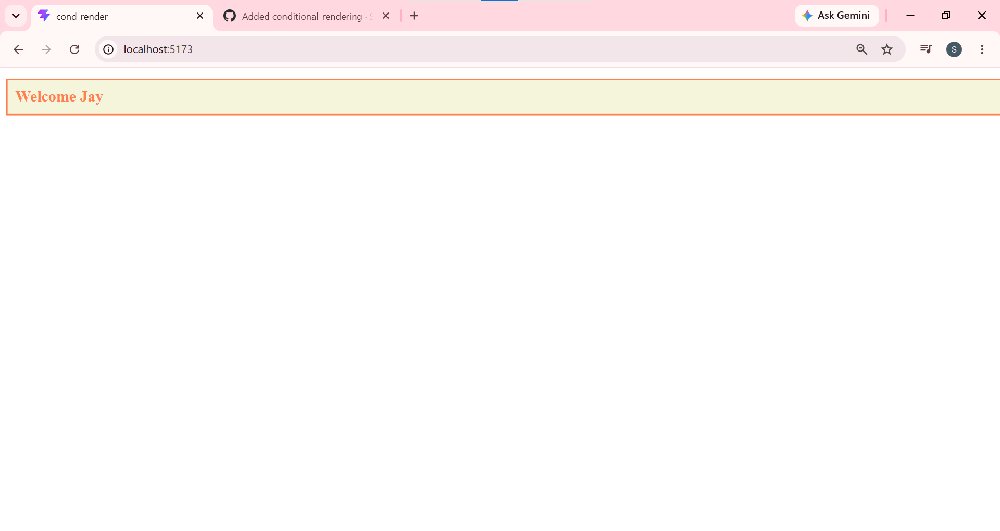

1.UserGreeting React App

A simple React application demonstrating **conditional rendering** using props.

2.Project Structure


src/
├── App.jsx
├── UserGreeting.jsx
└── index.css

3.Components

a) `App.jsx`
The root component. Renders the `UserGreeting` component and passes two props:
- `isLoggedIn` — boolean that controls which message is displayed
- `username` — string displayed in the welcome message when the user is logged in

b) `UserGreeting.jsx`
A functional component that conditionally renders one of two messages based on the `isLoggedIn` prop:

Prop Value -> Output 

 `isLoggedIn={true}` -> Displays a styled **Welcome** message with the username |
 `isLoggedIn={false}` -> Displays a **Please log in to continue** message |

The component uses the **ternary operator** for conditional rendering:
```jsx
return (props.isLoggedIn ? welcomeMsg : loginMsg);
```

c)`index.css`
Provides two CSS classes for visual differentiation:


 `.welcome-msg` 
 `.Login-msg` 


4) Usage

To toggle between the welcome and login messages, change the `isLoggedIn` prop in `App.jsx`:

```jsx
// Show welcome message
<UserGreeting isLoggedIn={true} username="Jay" />

// Show login prompt
<UserGreeting isLoggedIn={false} username="Jay" />
```

Concepts Covered

- Functional Components — both components are written as plain functions
- Props — passing data (`isLoggedIn`, `username`) from parent to child
- Conditional Rendering — using the ternary operator to display different JSX based on a boolean prop
- CSS Class Styling — applying different styles to elements via `className`

