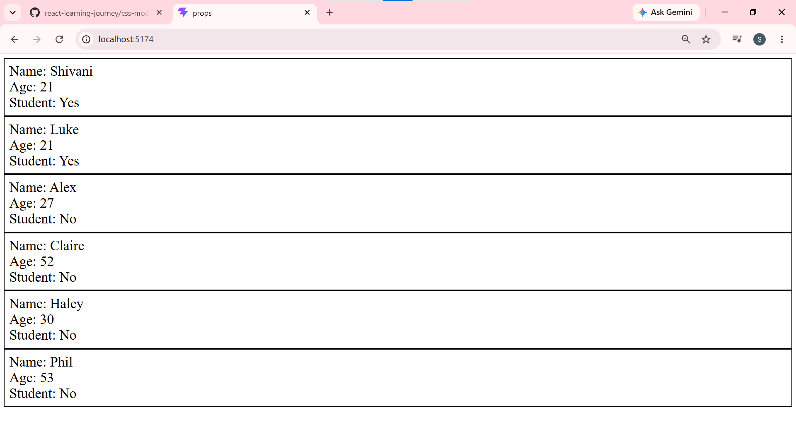

1. React Props & PropTypes Demo

A beginner-friendly React project demonstrating how to pass props, validate them with PropTypes, and set default props in a functional component.


2.📁 Project Structure

```
src/
├── App.jsx        # Root component — renders Student cards
└── Student.jsx    # Reusable Student component
```

---

3. 📄 File Overview

a)`App.jsx`
The root component that renders multiple `Student` components with different prop values.

- Imports the `Student` component
- Passes `name`, `age`, and `isStudent` as props to each student
- Phil is rendered **without `isStudent`** to demonstrate `defaultProps` fallback

b) `Student.jsx`
A reusable functional component that displays a single student's details.

- Accepts `props.name`, `props.age`, and `props.isStudent`
- Displays `"Yes"` or `"No"` for `isStudent` using a ternary operator
- Validates props using `PropTypes`
- Uses `defaultProps` as fallback when props are not passed

---

c)👨‍🎓 Students Rendered

| Name    | Age | Is Student |
|---------|-----|------------|
| Shivani | 21  | Yes        |
| Luke    | 21  | Yes        |
| Alex    | 27  | No         |
| Claire  | 52  | No         |
| Haley   | 30  | No         |
| Phil    | 53  | No *(default)* |

Note:Phil is rendered without the `isStudent` prop, so `defaultProps` kicks in and sets it to `false`, displaying `"No"`.

---

d) ✅ PropTypes Validation

| Prop        | Type    | Required |
|-------------|---------|----------|
| `name`      | String  | No       |
| `age`       | Number  | No       |
| `isStudent` | Boolean | No       |

---

e) 🔧 Default Props

If a prop is not passed, these fallback values are used:

```js
Student.defaultProps = {
    name: "Guest",
    age: 0,
    isStudent: false,
}
```

---

3. 🚀 Getting Started

 Prerequisites
- Node.js installed
- React project set up with Vite

Install dependencies
```bash
npm install
```

Install prop-types
```bash
npm install prop-types
```

Run the app
```bash
npm run dev
```

Then open [http://localhost:5173](http://localhost:5173) in your browser.


4.💡 Concepts Covered

- Props — passing data from parent (`App`) to child (`Student`) component
- PropTypes — runtime type checking for props
- defaultProps — fallback values when props are not provided
- Ternary operator — `isStudent ? "Yes" : "No"` for conditional rendering

